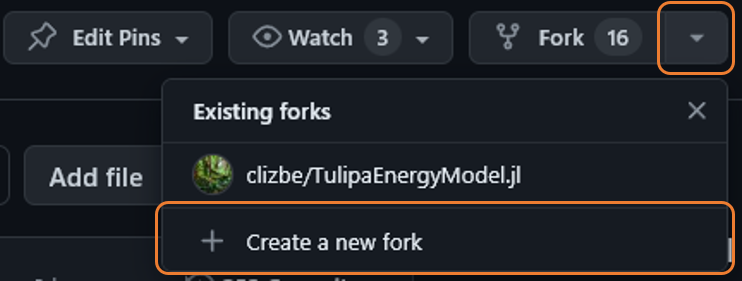
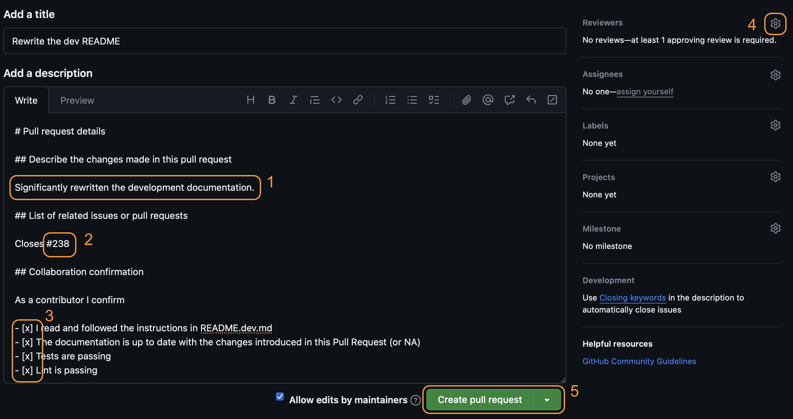
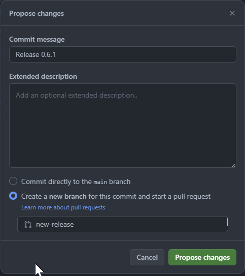
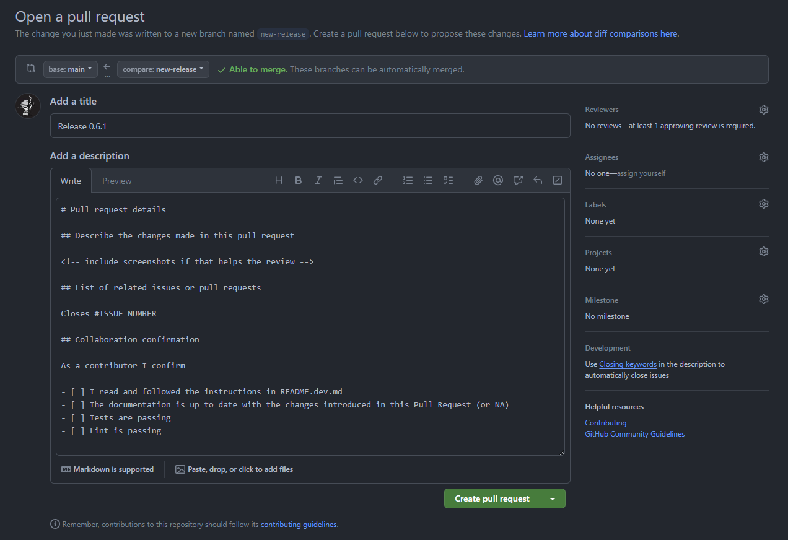
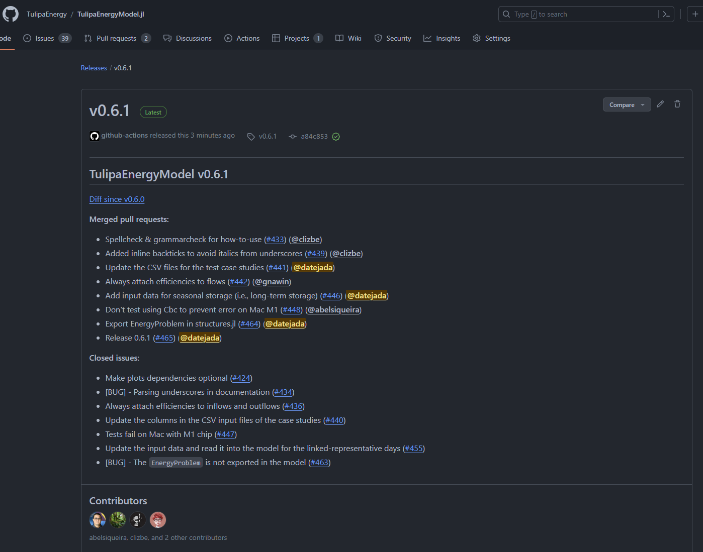

# Developer documentation

Welcome to TulipaEnergyModel.jl developer documentation. Here is how you can
contribute to our Julia-based toolkit for modeling and optimization of electric
energy systems.

## Before You Begin

Before you can start contributing, please read our [CONTRIBUTING.md](https://github.com/TulipaEnergy/TulipaEnergyModel.jl/blob/main/CONTRIBUTING.md).

Also make sure that you have installed the
required software, and that it is properly configured. You only need to do this
once.

### Installing Software

To contribute to TulipaEnergyModel.jl, you need the following:

1.  [Julia](https://julialang.org) programming language.
2.  [Git](https://git-scm.com) for version control.
3.  [VSCode](https://code.visualstudio.com) or any other editor. For VSCode, we recommend
    to install a few extensions. You can do it by pressing <kbd>Ctrl</kbd> + <kbd>Shift</kbd> + <kbd>X</kbd> (or <kbd>⇧</kbd> + <kbd>⌘</kbd> + <kbd>X</kbd> on MacOS) and searching by the extension name. - [Julia for Visual Studio Code](https://www.julia-vscode.org); - [Git Graph](https://marketplace.visualstudio.com/items?itemName=mhutchie.git-graph).
4.  [EditorConfig](https://editorconfig.org) for consistent code formatting.
    In VSCode, it is available as
    [an extension](https://marketplace.visualstudio.com/items?itemName=EditorConfig.EditorConfig).
5.  [pre-commit](https://pre-commit.com) to run the linters and formatters.

    You can install `pre-commit` globally using

    ```bash
    pip install --user pre-commit
    ```

    If you prefer to create a local environment with it, do the following:

    ```bash
    python -m venv env
    . env/bin/activate
    pip install --upgrade pip setuptools pre-commit
    ```

    On Windows, you need to active the environment using the following command instead of the previous one:

    ```bash
    . env/Scrips/activate
    ```

6.  [JuliaFormatter.jl](https://github.com/domluna/JuliaFormatter.jl) for code
    formatting.

    To install it, open Julia REPL, for example, by typing in the
    command line:

    ```bash
    julia
    ```

    > **Note**:
    > `julia` must be part of your environment variables to call it from the
    > command line.

    Then press <kbd>]</kbd> to enter the package mode.
    In the package mode, enter the following:

    ```julia
    pkg> activate
    pkg> add JuliaFormatter
    ```

    In VSCode, you can activate "Format on Save" for `JuliaFormatter`. To do so,
    open VSCode Settings (<kbd>Ctrl</kbd> + <kbd>,</kbd>), then in "Search
    Settings", type "Format on Save" and tick the first result:

    

7.  [Prettier](https://prettier.io/) for markdown formatting.
    In VSCode, it is available as
    [an extension](https://marketplace.visualstudio.com/items?itemName=esbenp.prettier-vscode).

    Having enabled "Format on Save" for `JuliaFormatter` in the previous step will also enable "Format on Save" for `Prettier`, provided that `Prettier` is set as the default formatter for markdown files. To do so, in VSCode, open any markdown file, right-click on any area of the file, choose "Format Document With...", click "Configure Default Formatter..." situated at the bottom of the drop-list list at the top of the screen, and then choose `Prettier - Code formatter` as the default formatter. Once you are done, you can double-check it by again right-clicking on any area of the file and choosing "Format Document With...", and you should see `Prettier - Code formatter (default)`.

8.  [LocalCoverage](https://juliapackages.com/p/localcoverage) for coverage
    testing. You can install it the same way you installed `JuliaFormatter`,
    that is, by opening Julia REPL in the package mode and typing:

        ```julia
        pkg> activate
        pkg> add LocalCoverage
        ```

### Forking the Repository

Any changes should be done in a [fork](https://docs.github.com/en/get-started/quickstart/fork-a-repo). You can fork this repository directly on GitHub:



After that, clone your fork and add this repository as upstream:

```bash
git clone https://github.com/your-name/TulipaEnergyModel.jl                   # use the fork URL
git remote add upstream https://github.com/TulipaEnergy/TulipaEnergyModel.jl  # use the original repository URL
```

### Configuring Git

Because operating systems use different line endings for text files, you need to configure Git to ensure code consistency across different platforms. You can do this with the following commands:

```bash
cd /path/to/TulipaEnergyModel.jl
git config --unset core.autocrlf         # disable autocrlf in the EnergyModel repo
git config --global core.autocrlf false  # explicitly disable autocrlf globally
git config --global --unset core.eol     # disable explicit file-ending globally
git config core.eol lf                   # set Linux style file-endings in EnergyModel
```

### Activating and Testing the Package

Start Julia REPL either via the command line or in the editor.

In the terminal, do:

```bash
cd /path/to/TulipaEnergyModel.jl  # change the working directory to the repo directory if needed
julia                             # start Julia REPL
```

In VSCode, first open your cloned fork as a new project. Then open the command palette with <kbd>Ctrl</kbd> + <kbd>Shift</kbd> + <kbd>P</kbd> (or <kbd>⇧</kbd> + <kbd>⌘</kbd> + <kbd>P</kbd> on MacOS) and use the command called `Julia: Start REPL`.

In Julia REPL, enter the package mode by pressing <kbd>]</kbd>.

In the package mode, first activate and instantiate the project, then run the
tests to ensure that everything is working as expected:

```bash
pkg> activate .   # activate the project
pkg> instantiate  # instantiate to install the required packages
pkg> test         # run the tests
```

### Configuring Linting and Formatting

With `pre-commit` installed, activate it as a pre-commit hook:

```bash
pre-commit install
```

To run the linting and formatting manually, enter the command below:

```bash
pre-commit run -a
```

Do it once now to make sure that everything works as expected.

Now, you can only commit if all the pre-commit tests pass.

> **Note**:
> On subsequent occasions when you need to run pre-commit in a new shell, you
> will need to activate the Python virtual environment. If so, do the following:
>
> ```bash
> . env/bin/activate  # for Windows the command is: . env/Scripts/activate
> pre-commit run -a
> ```

## Code format and guidelines

This section will list the guidelines for code formatting **not enforced** by [JuliaFormatter](.JuliaFormatter.toml).
We will try to follow these during development and reviews.

-   Naming
    -   `CamelCase` for classes and modules,
    -   `snake_case` for functions and variables, and
    -   `kebab-case` for file names.
-   Use `using` instead of `import`, in the following way:
    -   Don't use pure `using Package`, always list all necessary objects with `using Package: A, B, C`.
    -   List obvious objects, e.g., `using JuMP: @variable`, since `@variable` is obviously from JuMP in this context, or `using Graph: SimpleDiGraph`, because it's a constructor with an obvious name.
    -   For other objects inside `Package`, use `using Package: Package` and explicitly call `Package.A` to use it, e.g., `DataFrames.groupby`.
    -   List all `using` in <src/TulipaEnergyModel.jl>.

## Contributing Workflow

When the software is installed and configured, and you have forked the
TulipaEnergyModel.jl repository, you can start contributing to it.

We use the following workflow for all contributions:

1. Make sure that your fork is up to date
2. Create a new branch
3. Implement the changes
4. Run the tests
5. Run the linter
6. Commit the changes
7. Repeat steps 3-6 until all necessary changes are done
8. Make sure that your fork is still up to date
9. Create a pull request

Below you can find detailed instructions for each step.

### 1. Make Sure That Your Fork Is Up to Date

Fetch from org remote, fast-forward your local main:

```bash
git switch main
git fetch --all --prune
git merge --ff-only origin/main
```

> **Warning**:
> If you have a conflict on your main, it will appear now. You can delete
> your old `main` branch using
>
> ```bash
> git reset --hard origin/main
> ```

### 2. Create a New Branch

Create a branch to address the issue:

```bash
git switch -c <branch_name>
```

-   If there is an associated issue, add the issue number to the branch name,
    for example, `123-short-description` for issue \#123.
-   If there is no associated issue **and the changes are small**, add a prefix such as "typo", "hotfix", "small-refactor", according to the type of update.
-   If the changes are not small and there is no associated issue, then create the issue first, so we can properly discuss the changes.

> **Note**:
> Always branch from `main`, i.e., the main branch of your own fork.

### 3. Implement the Changes

Implement your changes to address the issue associated with the branch.

### 4. Run the Tests

In Julia:

```bash
TulipaEnergyModel> test
```

To run the tests with code coverage, you can use the `LocalCoverage` package:

```julia
julia> using LocalCoverage
# ]
pkg> activate .
# <backspace>
julia> cov = generate_coverage()
```

This will run the tests, track line coverage and print a report table as output.
Note that we want to maintain 100% test coverage. If any file does not show 100%
coverage, please add tests to cover the missing lines.

If you are having trouble reaching 100% test coverage, you can set your pull
request to 'draft' status and ask for help.

### 5. Run the Linter

In the bash/git bash terminal, run pre-commit:

```bash
. env/bin/activate # if necessary (for Windows the command is: . env/Scripts/activate)
pre-commit run -a
```

If any of the checks failed, find in the pre-commit log what the issues are and
fix them. Then, add them again (`git add`), rerun the tests & linter, and commit.

### 6. Commit the Changes

When the test are passing, commit the changes and push them to the remote
repository. Use:

```bash
git commit -am "A short but descriptive commit message" # Equivalent to: git commit -a -m "commit msg"
git push -u myfork <branch_name>
```

When writing the commit message:

-   use imperative, present tense (Add feature, Fix bug);
-   have informative titles;
-   if necessary, add a body with details.

> **Note**:
> Try to create "atomic git commits". Read
> [_The Utopic Git History_](https://blog.esciencecenter.nl/the-utopic-git-history-d44b81c09593)
> to learn more.

### 7. Make Sure That Your Fork Is Still Up to Date

If necessary, fetch any `main` updates from upstream and rebase your branch into
`origin/main`. For example, do this if it took some time to resolve the issue
you have been working on. If you don't resolve conflicts locally, you will
get conflicts in your pull request.

Do the following steps:

```bash
git switch main                  # switch to the main branch
git fetch --all --prune          # fetch the updates
git merge --ff-only origin/main  # merge as a fast-forward
git switch <branch_name>         # switch back to the issue branch
git rebase main <branch_name>    # rebase it
```

If it says that you have conflicts, resolve them by opening the file(s) and
editing them until the code looks correct to you. You can check the changes
with:

```bash
git diff             # Check that changes are correct.
git add <file_name>
git diff --staged    # Another way to check changes, i.e., what you will see in the pull request.
```

Once the conflicts are resolved, commit and push.

```bash
git status # Another way to show that all conflicts are fixed.
git rebase --continue
git push --force myfork <branch_name>
```

### 8. Create a Pull Request

When there are no more conflicts and all the test are passing, create a pull
request to merge your remote branch into the org main. You can do this on
GitHub by opening the branch in your fork and clicking "Compare & pull request".


Fill in the pull request details:

1. Describe the changes.
2. List the issue(s) that this pull request closes.
3. Fill in the collaboration confirmation.
4. (Optional) Choose a reviewer.
5. When all of the information is filled in, click "Create pull request".



You pull request will apper in the list of pull requests in the
TulipaEnergyModel.jl repository, where you can track the review process.

Sometimes reviewers request changes. After pushing any changes,
the pull request will be automatically updated. Do not forget to re-request a
review.

Once your reviewer approves the pull request, you need to merge it with the
main branch using "Squash and Merge".
You can also delete the branch that originated the pull request by clicking the button that appears after the merge.
For branches that were pushed to the main repo, it is recommended that you do so.

## Code format and guidelines

This section will list the guidelines for code formatting **not enforced** by [JuliaFormatter](.JuliaFormatter.toml).
We will try to follow these during development and reviews.

-   Naming
    -   `CamelCase` for classes and modules,
    -   `snake_case` for functions and variables, and
    -   `kebab-case` for file names.
-   Use `using` instead of `import`, in the following way:

    -   Don't use pure `using Package`, always list all necessary objects with `using Package: A, B, C`.
    -   List obvious objects, e.g., `using JuMP: @variable`, since `@variable` is obviously from JuMP in this context, or `using Graph: SimpleDiGraph`, because it's a constructor with an obvious name.
    -   For other objects inside `Package`, use `using Package: Package` and explicitly call `Package.A` to use it, e.g., `DataFrames.groupby`.
    -   List all `using` in <src/TulipaEnergyModel.jl>.

## Building the Documentation Locally

To build and view the documentation locally, first, navigate to the `docs` folder
in your file explorer and open a terminal. Then, run `julia --project`. With the
`julia` open, enter the `pkg` mode by pressing `]`.
Check that the environment name is `docs`. The first time here, you have to run:

```julia-pkg
docs> dev ..
docs> update
```

**Note:**
If you intend to rerun the build step, ensure you have the package `Revise`
installed in your global environment, and run `using Revise` before including
`make.jl`. Alternatively, close `julia` and reopen it.

Then, to build the documentation, run in Julia:

```julia
julia> include("make.jl")
```

After building, the documentation will be available in the folder `docs/build/`.
Open the `index.html` file on the browser to see it.

## Performance Considerations

If you updated something that might impact the performance of the package, you
can run the `Benchmark.yml` workflow from your pull request. To do that, add
the tag `benchmark` in the pull request. This will trigger the workflow and
post the results as a comment in you pull request.

> **Warning**:
> This requires that your branch was pushed to the main repo.
> If you have created a pull request from a fork, the Benchmark.yml workflow does not work.
> Instead, close your pull request, push your branch to the main repo, and open a new pull request.

If you want to manually run the benchmarks, you can do the following:

-   Navigate to the benchmark folder
-   Run `julia --project=.`
-   Enter `pkg` mode by pressing `]`
-   Run `dev ..` to add the development version of TulipaEnergyModel
-   Now run

    ```julia
    include("benchmarks.jl")
    tune!(SUITE)
    results = run(SUITE, verbose=true)
    ```

### Profiling

To profile the code in a more manual way, here are some tips:

-   Wrap your code into functions.
-   Call the function once to precompile it. This must be done after every change to the function.
-   Prefix the function call with `@time`. This is the most basic timing, part of Julia.
-   Prefix the function call with `@btime`. This is part of the BenchmarkTools package, which you might need to install. `@btime` will evaluate the function a few times to give a better estimate.
-   Prefix the function call with `@benchmark`. Also part of BenchmarkTools. This will produce a nice histogram of the times and give more information. `@btime` and `@benchmark` do the same thing in the background.
-   Call `@profview`. This needs to be done in VSCode, or using the ProfileView package. This will create a flame graph, where each function call is a block. The size of the block is proportional to the aggregate time it takes to run. The blocks below a block are functions called inside the function above.

See the file <benchmark/profiling.jl> for an example of profiling code.

## Procedure for Releasing a New Version (Julia Registry)

When publishing a new version of the model to the Julia Registry, follow this procedure:

**Note**:
To be able to register, you need to be a member of the organisation TulipaEnergy and have your visibility set to public:


1. Click on the `Project.toml` file on GitHub.

2. Edit the file and change the version number according to [semantic versioning](https://semver.org/): Major.Minor.Patch
   

3. Commit the changes in a new branch and open a pull request. Change the commit message according to the version number.
   

4. Create the pull request and squash & merge it after the review and testing process. Delete the branch after the squash and merge.
   

5. Go to the main page of repo and click in the commit.
   

6. Add the following comment to the commit: `@JuliaRegistrator register`
   

7. The bot should start the registration process.
   

8. After approval, the bot will take care of the PR at the Julia Registry and automatically create the release for the new version.
   

    Thank you for helping make frequent releases!
