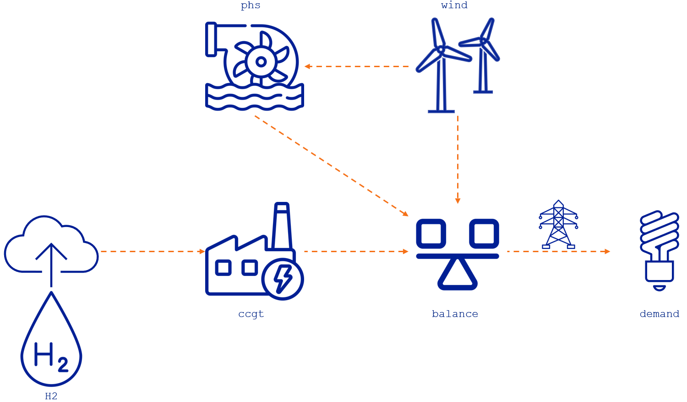
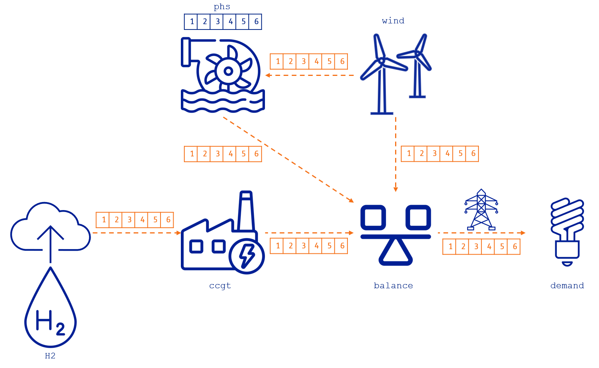
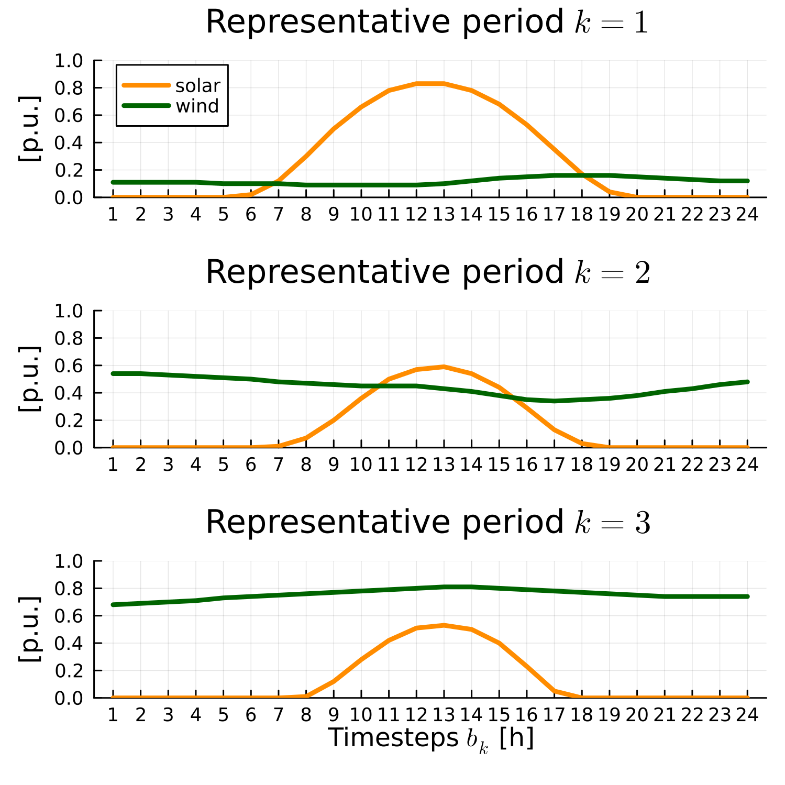
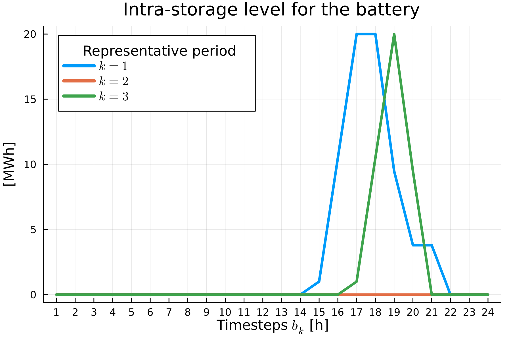
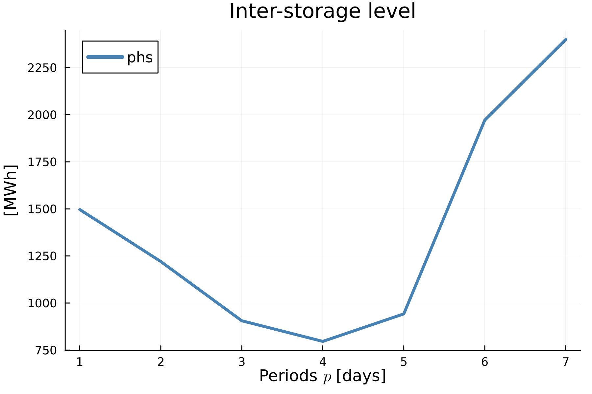

# [Features](@id features)

```@contents
Pages = ["features.md"]
Depth = 3
```

## [Basic Concepts](@id basic-concepts)

_TulipaEnergyModel.jl_ incorporates two fundamental concepts that serve as the foundation of the optimization model:

-   **Energy Assets**: representation of a physical asset that can produce, consume, store, balance, or convert energy. Some examples of what these assets can represent are:
    -   Producer: e.g., wind turbine, solar panel
    -   Consumer: e.g., electricity demand, heat demand
    -   Storage: e.g., battery, pumped-hydro storage
    -   Balancing Hub: e.g., an electricity network that serves as a connection among other energy assets
    -   Conversion: e.g., power plants, electrolyzers
-   **Flows**: representation of the connections among assets, e.g., pipelines, transmission lines, or just simply the energy production that goes from one asset to another.

In a nutshell, the model guarantees a balance of energy for the various types of assets while considering the flow limits. It considers a set of [representative periods](@ref representative-periods) (e.g., days or weeks) for a given [timeframe](@ref timeframe) (e.g., a year) the user wants to analyze. Therefore, the model has two types of temporal constraints to consider the different chronology characteristics of the assets:

-   **Intra-temporal Constraints**: These constraints limit the asset within a representative period. The intra-temporal constraints help to characterize the short-term operational dynamics of the assets. So far, the model considers balance and flow limitations within the representative period, but future developments will include unit commitment, ramping, and reserve constraints.
-   **Inter-temporal Constraints**: These constraints combine the information of the representative periods and create limitations between them to recover chronological information across the defined timeframe. The inter-temporal constraints help to characterize the long-term operational dynamics of the assets. So far, the model uses this type of constraint to model seasonal storage, but future developments will include, for example, maximum or minimum production/consumption in a year.

The [`mathematical formulation`](@ref formulation) shows a general overview of these constraints and the variables involved in the model.

Another essential concept in the model is the [flexible time resolution](@ref flex-time-res), which allows for each asset to be considered in a single time step (e.g., 1, 2, 3...) or in a range of time steps (e.g., 1:3, meaning that the asset's variable represents the value of time steps 1, 2, and 3). This concept allows the model of different dynamics depending on the asset; for instance, electricity assets can be modeled hourly, whereas hydrogen assets can be modeled in a 6-hour resolution (avoiding creating unnecessary constraints and variables).

The following sections explain the main features of the optimization model based on all these concepts and definitions.

## [Flexible Connection of Energy Assets](@id flex-asset-connection)

The representation of the energy system in _TulipaEnergyModel.jl_ is based on [Graph Theory](https://en.wikipedia.org/wiki/Graph_theory), which deals with the connection between vertices by edges. This representation provides a more flexible framework to model _energy assets_ in the system as _vertices_ and _flows_ between energy assets as _edges_. In addition, it can potentially reduce the model size. For instance, connecting assets directly to each other (i.e., without having a node in between) allows us to reduce the number of variables and constraints to represent different configurations. For instance, it is becoming more and more common to have hybrid assets like `storage + renewable` (e.g., battery + solar), `electrolyzer + renewable` (e.g., electrolyzer + wind), or `renewable + hydro` (e.g., solar + hydro) that are located in the same site and share a common connection point to the grid. In hybrid configurations, for example, flows from the grid are typically not allowed as they either avoid charging from the grid or require green hydrogen production.

Consider the following example to demonstrate the benefits of this approach. In the classic connection approach, the nodes play a crucial role in modeling. For instance, every asset must be connected to a node with balance constraints. When a storage asset and a renewable asset are in a hybrid connection like the one described before, a connection point is needed to connect the hybrid configuration to the rest of the system. Therefore, to consider the hybrid configuration of a storage asset and a renewable asset, we must introduce a node (i.e., a connection point) between these assets and the external power grid (i.e., a balance point), as shown in the following figure:


In this system, the `phs` storage asset charges and discharges from the `connection point`, while the `wind` turbine produces power that goes directly to the `connection point`. This `connection point` is connected to the external power grid through a transmission line that leads to a `balance` hub with/connecting to other assets. Essentially, the `connection point` acts as a balancing hub point for the assets in this hybrid configuration. Furthermore, these hybrid configurations impose an additional constraint to avoid storage charges from the power grid. The section [`comparison of different modeling approaches`](@ref comparison) shows the quantification of these reductions.

Let's consider the modeling approach in _TulipaEnergyModel.jl_. As nodes are no longer needed to connect assets, we can connect them directly to each other, as shown in the figure below:



By implementing this approach, we can reduce the number of variables and constraints involved. For example, the balance constraint in the intermediate node and the extra constraint to avoid the storage charging from the power grid are no longer needed. Additionally, we can eliminate the variable determining the flow between the intermediate node and the power grid because the flow from `phs` to `balance` can directly link to the external grid.

The example here shows the connection of a `phs` and a `wind` asset, illustrating the modeling approach's advantages and the example's reusability in the following sections. However, other applications of these co-location (or hybrid) combinations of assets are battery-solar, hydro-solar, and electrolyzer-wind.

## [Flexible Time Resolution](@id flex-time-res)

One of the core features of _TulipaEnergyModel.jl_ is that it can handle different time resolutions on the assets and the flows. Typically, the time resolution in an energy model is hourly, like in the following figure where we have a six-hour energy system:



Therefore, for this simple example, we can determine the number of constraints and variables in the optimization problem:

-   _Number of variables_: 42 since we have six connections among assets (i.e., 6 flows x 6 hours = 36 variables) and one storage asset (i.e., 6 storage level x 6 h = 6 variables)
-   _Number of constraints_: 72, where:

    -   24 from the maximum output limit of the assets that produce, convert, or discharge energy (i.e., `H2`, `wind`, `ccgt`, and `phs`) for each hour (i.e., 4 assets x 6 h = 24 constraints)
    -   6 from the maximum input limit of the storage or charging limit for the `phs`
    -   6 from the maximum storage level limit for the `phs`
    -   12 from the import and export limits for the transmission line between the `balance` hub and the `demand`
    -   24 from the energy balance on the consumer, hub, conversion, and storage assets (i.e., `demand`, `balance`, `ccgt`, and `phs`) for each hour (i.e., 4 assets x 6 h = 24 constraints)

Depending on the input data and the level of detail you want to model, hourly resolution in all the variables might not be necessary. _TulipaEnergyModel_.jl\_ can have different time resolutions for each asset and flow to simplify the optimization problem and approximate hourly representation. This feature is handy for large-scale energy systems that involve other sectors, as detailed granularity is not always necessary due to the unique temporal dynamics of each sector. For instance, we can use hourly resolution for the electricity sector and six-hour resolution for the hydrogen sector. We can couple multiple sectors, each with its temporal resolution.

Let's explore the flexibility of time resolution with the following examples. The following table shows the user input data for the definition of asset time resolution. Please note that the values presented in this example are just for illustrative purposes and do not represent a realistic case.

```@example print-partitions
using DataFrames # hide
using CSV # hide
input_asset_file = "../../test/inputs/Variable Resolution/assets-rep-periods-partitions.csv" # hide
assets = CSV.read(input_asset_file, DataFrame, header = 2) # hide
assets = assets[assets.asset .!= "wind", :] # hide
```

The asset definitions are determined in a file called [`assets-rep-periods-partitions.csv`](@ref asset-rep-periods-partitions-definition). For instance, the example in the file shows that the `H2` producer and the `phs` storage have a `uniform` definition of 6 hours. This definition means we want to represent the `H2` production profile and the storage level of the `phs` every six hours.

If an asset is not specified in this file, the balance equation will be written in the lowest resolution of both incoming and outgoing flows to the asset. For example, the incoming and outgoing flows to the hub asset (`balance`) will determine how often the balance constraint is written.

The same type of definition can be done for the flows, for example (again, the values are for illustrative purposes and do not represent a realistic case):

```@example print-partitions
input_flow_file = "../../test/inputs/Variable Resolution/flows-rep-periods-partitions.csv" # hide
flows_partitions = CSV.read(input_flow_file, DataFrame, header = 2) # hide
```

These definitions are determined in the [`flows-rep-periods-partitions.csv`](@ref flow-rep-periods-partitions-definition) file. The example shows a `uniform` definition for the flow from the hydrogen producer (`H2`) to the conversion asset (`ccgt`) of six hours, from the wind producer (`wind`) to the storage (`phs`) of three hours, and from the balance hub (`balance`) to the consumer (`demand`) of three hours, too. In addition, the flow from the wind producer (`wind`) to the balance hub (`balance`) is defined using the `math` specification of `1x2+1x4`, meaning that there are two time blocks, one of two hours (i.e., `1:2`) and another of four hours (i.e., `3:6`). Finally, the flow from the storage (`phs`) to the balance hub (`balance`) is defined using the `math` specification of `1x4+1x2`, meaning that there are two time blocks, one of four hours (i.e., `1:4`) and another of two hours (i.e., `5:6`).

If a flow is not specified in this file, the flow time resolution will be for each time step by default (e.g., hourly). For instance, the flow from the `ccgt` to the hub `balance` will be written hourly in this example.

The following figure illustrates these definition on the example.


So, let's recap:

-   The hydrogen producer (`H2`) is in a six-hour resolution represented by the range `1:6`, meaning that the balance of the hydrogen produced is for every six hours.
-   The flow from the hydrogen producer to the ccgt power plant (`H2,ccgt`) is also in a six-hour resolution `1:6`.
-   The flow from the ccgt power plant to the balance hub (`ccgt, balance`) has hourly resolution `[1,2,3,4,5,6]`.
-   The `ccgt` is a conversion plant that takes hydrogen to produce electricity. Since both sectors have different time resolutions. The energy balance in the conversion asset is defined in the lowest resolution connecting to the asset. In this case, the energy balance in the `ccgt` is defined every six hours, i.e., in the range `1:6`.
-   The `wind` producer has an hourly profile of electricity production, so the resolution of the asset is still hourly.
-   The `wind` producer output has two connections, one to the `balance` hub and the other to the pumped-hydro storage (`phs`) with different resolutions:
    -   The flow from the wind producer to the phs storage (`wind, phs`) has a uniform resolution of two blocks from hour 1 to 3 (i.e., `1:3`) and from hour 4 to 6 (i.e., `4:6`).
    -   The flow from the wind producer to the balance hub (`wind, balance`) has a variable resolution of two blocks, too, but from hour 1 to 2 (i.e., `1:2`) and from hour 3 to 6 (i.e., `3:6`).
-   The `phs` is in a six-hour resolution represented by the range `1:6`, meaning the storage balance is determined every six hours.
-   The flow from the phs to the balance (`phs, balance`) represents the discharge of the `phs`. This flow has a variable resolution of two blocks from hour 1 to 4 (i.e., `1:4`) and from hour 5 to 6 (i.e., `5:6`), which differs from the one defined for the charging flow from the `wind` asset.
-   The `demand` consumption has hourly input data with one connection to the `balance` hub:
    -   The flow from the balance hub to the demand (`balance, demand`) has a uniform resolution of three hours; therefore, it has two blocks, one from hour 1 to 3 (i.e., `1:3`) and the other from hour 4 to 6 (i.e., `4:6`).
-   The `balance` hub integrates all the different assets with their different resolutions. The lowest resolution of all connections determines the balance equation for this asset. Therefore, the resulting resolution is into two blocks, one from hour 1 to 4 (i.e., `1:4`) and the other from hour 5 to 6 (i.e., `5:6`). Notice that the resulting resolution comes from using the function [`compute_rp_partition`](@ref), which applies a `:greedy` forward strategy to obtain the lowest resolution of all connecting assets. It is possible that other strategies, such as the backward strategy, could be helpful. However, these are outside the current scope of the model and may be the subject of future research.

> **Note:**
> This example demonstrates that different time resolutions can be assigned to each asset and flow in the model. Additionally, the resolutions do not need to be uniform and can vary throughout the horizon.

The complete input data for this example can be found in the following [link](https://github.com/TulipaEnergy/TulipaEnergyModel.jl/tree/main/test/inputs/Variable%20Resolution).

Due to the flexible resolution, we must explicitly state how the constraints are constructed. For each constraint, three things need to be considered:

-   Whether it is type _power_ or type _energy_.
    -   type _power_: highest resolution
    -   type _energy_: lowest resolution (multiplied by durations)
-   How the resolution (no matter it is highest or lowest) is determined. Sometimes, it is determined by the incoming flows, sometimes the outgoing flows, or a combination of both.
-   How the related parameters are treated. We use two ways of aggregation, _sum_ or _mean_.

Below is the table outlining the details for each type of constraint. Note _min_ means highest resolution, and _max_ means lowest resolution.

| name                                          | variables involved             | Parameters involved | Constraint type | Resolution of the constraints                                               | Parameter aggregation |
| --------------------------------------------- | ------------------------------ | ------------------- | --------------- | --------------------------------------------------------------------------- | --------------------- |
| Consumer Balance                              | inputs, outputs                | demand              | power           | min(incoming flows, outgoing flows)                                         | mean                  |
| Storage Balance                               | inputs, outputs, storage level | inflows             | energy          | max(asset, min(incoming flows, outgoing flows))                             | sum                   |
| Hub Balance                                   | inputs, outputs                | -                   | power           | min(incoming flows, outgoing flows)                                         | -                     |
| Conversion Balance                            | inputs, outputs                | -                   | energy          | max(incoming flows, outgoing flows)                                         | -                     |
| Producers Capacity Constraints                | outputs                        | production          | power           | min(outgoing flows)                                                         | mean                  |
| Storage Capacity Constraints (outgoing)       | outputs                        | -                   | power           | min(outgoing flows)                                                         | -                     |
| Conversion Capacity Constraints (outgoing)    | outputs                        | -                   | power           | min(outgoing flows)                                                         | -                     |
| Conversion Capacity Constraints (incoming)    | inputs                         | -                   | power           | min(incoming flows)                                                         | -                     |
| Storage Capacity Constraints (incoming)       | inputs                         | -                   | power           | min(incoming flows)                                                         | -                     |
| Transport Capacity Constraints (upper bounds) | flow                           | capacity            | power           | if it connects two hubs or demands then max(hub a,hub b), otherwise its own | mean                  |
| Transport Capacity Constraints (lower bounds) | flow                           | capacity            | power           | if it connects two hubs or demands then max(hub a,hub b), otherwise its own | mean                  |

For this basic example, we can describe what the balance and capacity constraints in the model look like. For the sake of simplicity, we only consider the intra-temporal constraints, the representative period index is dropped from the equations, and there are no investment variables in the equations.

### Energy Balance Constraints

We lay out all the balance constraints of this example.

#### Storage Balance

As shown in the table, the resolution of the storage balance is energy, which is calculated by _max(asset, min(incoming flows, outgoing flows))_. The resolutions of the incoming and outgoing flows of the storage are `1:3`, `4:6`, `1:4`, and `5:6`, resulting in a minimum resolution of 2. The resolution of the storage is 6. Then, _max(asset, min(incoming flows, outgoing flows))_ becomes _max(6, min(3, (4, 2)))_ which results in 6, and thus this balance is written for every six hours. The charging and discharging flows are multiply by their durations to account for the energy in the range `1:6`.

```math
\begin{aligned}
& \text{storage\_balance}_{\text{phs},1:6}: \\
& \qquad v^{\text{intra-storage}}_{\text{phs},1:6} = 3 \cdot p^{\text{eff}}_{(\text{wind},\text{phs})} \cdot v^{\text{flow}}_{(\text{wind},\text{phs}),1:3} + 3 \cdot p^{\text{eff}}_{(\text{wind},\text{phs})} \cdot v^{\text{flow}}_{(\text{wind},\text{phs}),4:6} \\
& \qquad \quad - \frac{4}{p^{\text{eff}}_{(\text{phs},\text{balance})}} \cdot v^{\text{flow}}_{(\text{phs},\text{balance}),1:4} - \frac{2}{p^{\text{eff}}_{(\text{phs},\text{balance})}} \cdot v^{\text{flow}}_{(\text{phs},\text{balance}),5:6} \\
\end{aligned}
```

#### Consumer Balance

The flows coming from the balancing hub are defined every three hours. Therefore, the flows impose the lowest resolution and the balance at the demand is done every three hours. The input demand is aggregated as the mean of the hourly values in the input data. As in the storage balance, the flows are multiplied by their duration.

```math
\begin{aligned}
& \text{consumer\_balance}_{\text{demand},1:3}: \\
& \qquad v^{\text{flow}}_{(\text{balance},\text{demand}),1:3} = p^{\text{peak demand}}_{\text{demand}} \cdot \frac{\sum_{b=1}^{3} p^{\text{demand profile}}_{\text{demand},b}}{3} \\
& \text{consumer\_balance}_{\text{demand},4:6}: \\
& \qquad v^{\text{flow}}_{(\text{balance},\text{demand}),4:6} = p^{\text{peak demand}}_{\text{demand}} \cdot \frac{\sum_{b=4}^{6} p^{\text{demand profile}}_{\text{demand},b}}{3} \\
\end{aligned}
```

#### Hub Balance

The hub balance is quite interesting because it integrates several flow resolutions. Remember that we didn't define any specific time resolution for this asset. Therefore, the highest resolution of all incoming and outgoing flows in the horizon implies that the hub balance must be imposed for all the six blocks. The balance must account for each flow variable's duration in each block.

```math
\begin{aligned}
& \text{hub\_balance}_{\text{balance},1:1}: \\
& \qquad v^{\text{flow}}_{(\text{balance},\text{demand}),1:3} = v^{\text{flow}}_{(\text{ccgt},\text{balance}), 1:1} + v^{\text{flow}}_{(\text{wind},\text{balance}),1:2} + v^{\text{flow}}_{(\text{phs},\text{balance}),1:4} \\
& \text{hub\_balance}_{\text{balance},2:2}: \\
& \qquad v^{\text{flow}}_{(\text{balance},\text{demand}),1:3} = v^{\text{flow}}_{(\text{ccgt},\text{balance}), 2:2} + v^{\text{flow}}_{(\text{wind},\text{balance}),1:2} + v^{\text{flow}}_{(\text{phs},\text{balance}),1:4} \\
& \text{hub\_balance}_{\text{balance},3:3}: \\
& \qquad v^{\text{flow}}_{(\text{balance},\text{demand}),1:3} = v^{\text{flow}}_{(\text{ccgt},\text{balance}), 3:3} + v^{\text{flow}}_{(\text{wind},\text{balance}),3:6} + v^{\text{flow}}_{(\text{phs},\text{balance}),1:4} \\
& \text{hub\_balance}_{\text{balance},4:4}: \\
& \qquad v^{\text{flow}}_{(\text{balance},\text{demand}),4:6} = v^{\text{flow}}_{(\text{ccgt},\text{balance}), 4:4} + v^{\text{flow}}_{(\text{wind},\text{balance}),3:6} + v^{\text{flow}}_{(\text{phs},\text{balance}),1:4}\\
& \text{hub\_balance}_{\text{balance},5:5}: \\
& \qquad v^{\text{flow}}_{(\text{balance},\text{demand}),4:6} = v^{\text{flow}}_{(\text{ccgt},\text{balance}), 5:5} + v^{\text{flow}}_{(\text{wind},\text{balance}),3:6} + v^{\text{flow}}_{(\text{phs},\text{balance}),5:6} \\
& \text{hub\_balance}_{\text{balance},6:6}: \\
& \qquad v^{\text{flow}}_{(\text{balance},\text{demand}),4:6} = v^{\text{flow}}_{(\text{ccgt},\text{balance}), 6:6} + v^{\text{flow}}_{(\text{wind},\text{balance}),3:6} + v^{\text{flow}}_{(\text{phs},\text{balance}),5:6} \\
\end{aligned}
```

#### Conversion Balance

The flows connected to the CCGT conversion unit have different resolutions, too. In this case, the hydrogen imposes the lowest resolution; therefore, the energy balance in this asset is also for every six hours.

```math
\begin{aligned}
& \text{conversion\_balance}_{\text{ccgt},1:6}: \\
& \qquad 6 \cdot p^{\text{eff}}_{(\text{H2},\text{ccgt})} \cdot v^{\text{flow}}_{(\text{H2},\text{ccgt}),1:6} = \frac{1}{p^{\text{eff}}_{(\text{ccgt},\text{balance})}} \sum_{b=1}^{6} v^{\text{flow}}_{(\text{ccgt},\text{balance}),b}  \\
\end{aligned}
```

### Capacity Constraints

All capacity constraints are defined in the highest resolution to guarantee that the flows are below the limits of each asset capacity.

#### Storage Capacity Constraints

Since the storage unit only has one input and output, the capacity limit constraints are in the exact resolution as the individual flows. Therefore, The constraints for the outputs of the storage are (i.e., discharging capacity limit):

```math
\begin{aligned}
& \text{max\_output\_flows\_limit}_{\text{phs},1:4}: \\
& \qquad v^{\text{flow}}_{(\text{phs},\text{balance}),1:4} \leq p^{\text{init capacity}}_{\text{phs}} \\
& \text{max\_output\_flows\_limit}_{\text{phs},5:6}: \\
& \qquad v^{\text{flow}}_{(\text{phs},\text{balance}),5:6} \leq p^{\text{init capacity}}_{\text{phs}} \\
\end{aligned}
```

And the constraints for the inputs of the storage are (i.e., charging capacity limit):

```math
\begin{aligned}
& \text{max\_input\_flows\_limit}_{\text{phs},1:3}: \\
& \qquad v^{\text{flow}}_{(\text{wind},\text{phs}),1:3} \leq p^{\text{init capacity}}_{\text{phs}} \\
& \text{max\_input\_flows\_limit}_{\text{phs},4:6}: \\
& \qquad v^{\text{flow}}_{(\text{wind},\text{phs}),4:6} \leq p^{\text{init capacity}}_{\text{phs}} \\
\end{aligned}
```

#### Conversion Capacity Constraints

Similarly, each outflow is limited to the `ccgt` capacity for the conversion unit.

```math
\begin{aligned}
& \text{max\_output\_flows\_limit}_{\text{ccgt},b}: \\
& \qquad v^{\text{flow}}_{(\text{ccgt},\text{balance}),b} \leq p^{\text{init capacity}}_{\text{ccgt}} \quad \forall b \in [1,6] \\
\end{aligned}
```

#### Producers Capacity Constraints

The `wind` producer asset is interesting because the output flows are in different resolutions, i.e., `1:2`, `3:6`, `1:3`, and `4:6`. The highest resolution is `1:2`, `3`, and `4:6`.
Therefore, the constraints are as follows:

```math
\begin{aligned}
& \text{max\_output\_flows\_limit}_{\text{wind},1:2}: \\
& \qquad v^{\text{flow}}_{(\text{wind},\text{balance}),1:2} + v^{\text{flow}}_{(\text{wind},\text{phs}),1:3} \leq \frac{p^{\text{init capacity}}_{\text{wind}}}{2} \cdot \sum_{b=1}^{2} p^{\text{availability profile}}_{\text{wind},b} \\
& \text{max\_output\_flows\_limit}_{\text{wind},3}: \\
& \qquad v^{\text{flow}}_{(\text{wind},\text{balance}),3:6} + v^{\text{flow}}_{(\text{wind},\text{phs}),1:3} \leq p^{\text{init capacity}}_{\text{wind}} \cdot p^{\text{availability profile}}_{\text{wind},3} \\
& \text{max\_output\_flows\_limit}_{\text{wind},4:6}: \\
& \qquad v^{\text{flow}}_{(\text{wind},\text{balance}),3:6} + v^{\text{flow}}_{(\text{wind},\text{phs}),4:6} \leq \frac{p^{\text{init capacity}}_{\text{wind}}}{2} \cdot \sum_{b=5}^{6} p^{\text{availability profile}}_{\text{wind},b} \\
\end{aligned}
```

Since the flow variables $v^{\text{flow}}_{(\text{wind}, \text{balance}),1:2}$ and $v^{\text{flow}}_{(\text{wind}, \text{balance}),1:3}$ represent power, the first constraint sets the upper bound of the power for both time step 1 and 2, by assuming an average capacity across these two time steps. The same applies to the other two constraints.

The hydrogen (H2) producer capacity limit is straightforward since both the asset and the flow definition are in the exact time resolution:

```math
\begin{aligned}
& \text{max\_output\_flows\_limit}_{\text{H2},1:6}: \\
& \qquad v^{\text{flow}}_{(\text{H2},\text{ccgt}),1:6} \leq p^{\text{init capacity}}_{\text{H2}} \cdot p^{\text{availability profile}}_{\text{H2},1:6} \\
\end{aligned}
```

#### Transport Capacity Constraints

For the connection from the hub to the demand, there are associated transmission capacity constraints, which are in the exact resolution as the flow:

```math
\begin{aligned}
& \text{max\_transport\_flows\_limit}_{(\text{balance},\text{demand}),1:3}: \\
& \qquad v^{\text{flow}}_{(\text{balance},\text{demand}),1:3} \leq p^{\text{init export capacity}}_{(\text{balance},\text{demand})} \\
& \text{max\_transport\_flows\_limit}_{(\text{balance},\text{demand}),4:6}: \\
& \qquad v^{\text{flow}}_{(\text{balance},\text{demand}),4:6} \leq p^{\text{init export capacity}}_{(\text{balance},\text{demand})} \\
\end{aligned}
```

```math
\begin{aligned}
& \text{min\_transport\_flows\_limit}_{(\text{balance},\text{demand}),1:3}: \\
& \qquad v^{\text{flow}}_{(\text{balance},\text{demand}),1:3} \geq - p^{\text{init import capacity}}_{(\text{balance},\text{demand})} \\
& \text{min\_transport\_flows\_limit}_{(\text{balance},\text{demand}),4:6}: \\
& \qquad v^{\text{flow}}_{(\text{balance},\text{demand}),4:6} \geq - p^{\text{init import capacity}}_{(\text{balance},\text{demand})} \\
\end{aligned}
```

### Storage Level limits

Since the system has a storage asset, we must limit the maximum storage level. The `phs` time resolution is defined for every six hours, so we only have one constraint.

```math
\begin{aligned}
& \text{max\_storage\_level\_limit}_{\text{phs},1:6}: \\
& \qquad v^{\text{intra-storage}}_{\text{phs},1:6} \leq p^{\text{init storage capacity}}_{\text{phs}}
\end{aligned}
```

### [Comparison of Different Modeling Approaches](@id comparison)

This section quantifies the advantages of the [`flexible connection`](@ref flex-asset-connection) and [`flexible time resolution`](@ref flex-time-res) in the _TulipaEnergyModel.jl_ modeling approach. So, let us consider three different approaches based on the same example:

1. Classic approach with hourly resolution: This approach needs an extra asset, `node`, to create the hybrid operation of the `phs` and `wind` assets.
2. Flexible connection with hourly resolution: This approach uses the flexible connection to represent the hybrid operation of the `phs` and `wind` assets.
3. Flexible connection and time resolution: This approach uses both features, the flexible connection and the flexible time resolution.

> **Note:** _TulipaEnergyModel.jl_ is flexible enough to allow any of these three approaches to the model through the input data.

The table below shows the constraints and variables for each approach over a six-hour horizon. This result highlights the potential of flexible time resolution in reducing the size of the optimization model.

| Modeling approach                          | Nº Variables | Nº Constraints | Objective Function |
| :----------------------------------------- | :----------- | :------------- | :----------------- |
| Classic approach with hourly resolution    | 48           | 84             | 28.4365            |
| Flexible connection with hourly resolution | 42           | 72             | 28.4365            |
| Flexible connection and time resolution    | 16           | 29             | 28.4587            |

By comparing the classic approach with the other methods, we can analyze their differences:

-   The flexible connection with hourly resolution reduces 6 variables ($12.5\%$) and 12 constraints ($\approx 14\%$). Notice that we include the 6 extra constraints related to not allowing charging from the grid, although these constraints can also be modeled as bounds. Finally, the objective function is the same since, in both cases, we use an hourly time resolution.
-   The combination of features reduces 32 variables ($\approx 67\%$) and 55 constraints ($\approx 65\%$) with an approximation error of $\approx 0.073\%$.

The level of reduction and approximation error will depend on each case. The example demonstrates the potential for reduction and accuracy using the flexible time resolution feature in _TulipaEnergyModel.jl_. Some use cases for this feature include:

-   Coupling different energy sectors with various dynamics. For instance, methane, hydrogen, and heat sectors can be represented in energy models with lower resolutions (e.g., 4, 6, or 12h) than the electricity sector, usually modeled in higher resolutions (e.g., 1h, 30 min).

-   Having highly detailed resolutions for all your assets in a large-scale electricity case study may not be necessary. For example, if you analyze a European case study focusing on a specific country like The Netherlands, you may not require hourly details for distant countries. However, you would still want to consider their effect, such as Portugal and Spain. In such cases, flexible time resolution can help you maintain hourly details for assets in your focus country while reducing the detail in distant countries by increasing their resolution to two hours or more, depending on the desired level of accuracy. This feature will reduce the variables in the assets of the distant country.

## [Seasonal Storage Modeling](@id seasonal-storage)

The inter-temporal constraints in the [`mathematical formulation`](@ref formulation) for energy storage assets allow us to model the seasonal storage in the model. To better understand how this feature works in _TulipaEnergyModel.jl_, there is an example inside the code for this package in the folder [`test/inputs/Storage`](https://github.com/TulipaEnergy/TulipaEnergyModel.jl/tree/main/test/inputs/Storage).

Let's first look at this feature's most relevant input data, starting with the `assets-data` file. Here, we show only the storage assets in the file with the appropriate columns for this example, but all the input data can be found in the previously mentioned folder.

```@example seasonal-storage
using DataFrames # hide
using CSV # hide
input_asset_file = "../../test/inputs/Storage/assets-data.csv" # hide
assets = CSV.read(input_asset_file, DataFrame, header = 2) # hide
filtered_assets = assets[assets.type .== "storage", ["name", "type", "initial_capacity", "is_seasonal", "initial_storage_capacity", "initial_storage_level"]] # hide
```

The `is_seasonal` parameter determines if the storage asset uses or not the inter-temporal constraints. On the one hand, the `phs` is the only storage asset with this type of constraint and inter-storage level variable (i.e., $s^{\text{inter}}_{\text{phs},p}$). In addition, it has 100MW capacity and 4800MWh of storage capacity (i.e., 48h discharge duration). On the other hand, the `battery` will only consider intra-temporal constraints with intra-storage level variables (i.e., $s^{\text{intra}}_{\text{battery},k,b_k}$), and it has 10MW capacity with 20MWh of storage capacity (i.e., 2h discharge duration).

The `rep-periods-data` file has information on the representative periods in the example. We have three representative periods, each with 24 timesteps and hourly resolution, each representing a day. The figure below shows the availability profile of the renewable energy sources in the example.

```@example seasonal-storage
rp_file = "../../test/inputs/Storage/rep-periods-data.csv" # hide
rp = CSV.read(rp_file, DataFrame, header = 2) # hide
```



The `rep-periods-mapping` relates each representative period with the periods in the timeframe of the example. We have seven periods in this case, meaning the timeframe is a week. Each value in the file indicates the weight of each representative period in the timeframe period. Notice that each period is composed of a linear combination of the representative periods. For more details on obtaining the representative periods and the weights, please look at [_TulipaClustering.jl_](https://github.com/TulipaEnergy/TulipaClustering.jl). For the sake of readability, we show here the information in the file in tabular form:

```@example seasonal-storage
map_file = "../../test/inputs/Storage/rep-periods-mapping.csv" # hide
map = CSV.read(map_file, DataFrame, header = 2) # hide
unstacked_map = unstack(map, :period, :rep_period, :weight) # hide
rename!(unstacked_map, ["period", "k=1", "k=2", "k=3"]) # hide
unstacked_map[!,["k=1", "k=2", "k=3"]] = convert.(Float64, unstacked_map[!,["k=1", "k=2", "k=3"]]) # hide
unstacked_map # hide
```

The file `assets-timeframe-partitions` has the information on how often we want to consider the inter-temporal constraints that combine the information of the representative periods. In this example, we define a uniform distribution of one period, meaning that we will check the inter-storage level every day of the week in the timeframe.

```@example seasonal-storage
phs_partitions_file = "../../test/inputs/Storage/assets-timeframe-partitions.csv" # hide
phs_partitions = CSV.read(phs_partitions_file, DataFrame, header = 2) # hide
```

> **Note:**
> For the sake of simplicity, in this example, we show how using three representative days can recover part of the chronological information of one week. Nevertheless, the same rationale can be applied to more number of representative periods and a longer timeframe to analyze the seasonality across a year or more.

Let's now solve the example _TulipaEnergyModel.jl_ and explore the results:

```@example seasonal-storage
using TulipaEnergyModel

input_dir = "../../test/inputs/Storage" # hide
# input_dir should be the path to the Storage example
energy_problem = run_scenario(input_dir)
```

On the one hand, since the `battery` is not seasonal, it only has results for the intra-storage level for each representative period, as shown in the following figure:



On the other hand, the `phs` is defined as seasonal; therefore, it only has results for the inter-storage level. Since we defined the period partition as 1, we get results for each period (i.e., day). We can see that the inter-temporal constraints in the model keep track of the storage level through the whole timeframe definition (i.e., week).



> **Note:**
> In this example, we have demonstrated how it is possible to partially recover the chronological information of a storage asset with a larger energy capacity than the representative period length by considering three representative days that are independent of each other. For instance, if the storage asset has an energy capacity of 48 hours and we have a timeframe of one week, which is longer than the representative period length of 24 hours, we can map the periods in the timeframe to the representative periods to mix the information of representatives in different combinations to recover each period. This feature enables us to model both short- and long-term storage in _TulipaEnergyModel.jl_.

You can follow the [hydrothermal dispatch tutorial](@ref hydrothermal-example) for a more comprehensive example of seasonal storage use in the model.

## [Investment Modeling](@id investment-modeling)

_TulipaEnergyModel.jl_ can consider investments in assets and flows. The model can consider different levels of detail in the investment decision variables depending on the input data on the [assets-data](@ref assets-data) and [flows-data](@ref flows-data) files. For instance:

-   The `investable` parameter determines whether there is an investment decision for the asset or flow.
-   The `investment_integer` parameter determines if the investment decision is integer or continuous.
-   The `investment_cost` parameter represents the cost in the defined [timeframe](@ref timeframe). Thus, if the timeframe is a year, the investment cost is the annualized cost of the asset.
-   The `investment_limit` parameter limits the total investment capacity of the asset or flow. This limit represents the potential of that particular asset or flow. Without data in this parameter, the model assumes no investment limit.
